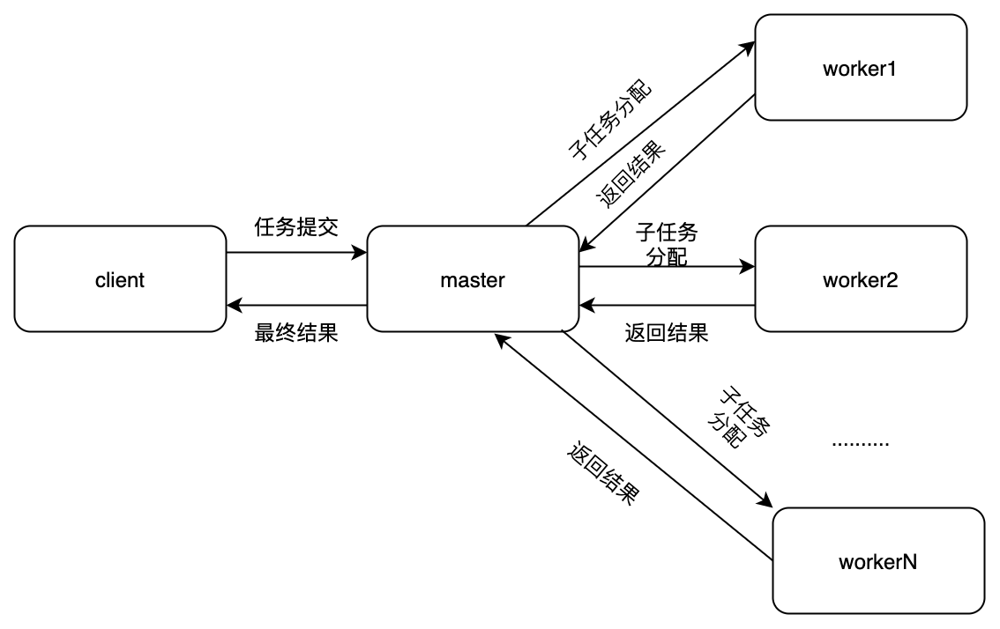

###百万数据的平方和相加 
(1)使用单线程，for循环的方式进行数据相加，最大的问题在于耗时较长
```java
package com.high.currency04.master;

public class SingleThreadCompute {
    public static Long handle(Long i) {
        try {
            Thread.sleep(5);
        } catch (InterruptedException e) {
            e.printStackTrace();
        }
        return i * i;
    }

    public static void main(String[] args) {
        Long start = System.currentTimeMillis();
        long tempResult;
        long result = 0;

        for (long i = 1; i < 1000001; i++) {
            System.out.println(i);
            tempResult = handle(i);
            result += tempResult;
        }
        System.out.println("single thread ,final result is  : " + result);
        Long end = System.currentTimeMillis();
        System.out.println("single thread ,process  time is : " + (end - start) +"  ms");
    }
}
``` 
(2)采用master与worker的设计方式 
######master与worker设计 
 
worker类 主要用途在于将结果存在于map中
```java
package com.high.currency04.master;
import java.util.Map;
import java.util.Queue;

public class Worker implements Runnable{
    protected Queue<Object> workQueue;
    protected Map<String, Object> resultMap;

    public void setWorkQueue(Queue<Object> workQueue) {
        this.workQueue = workQueue;
    }
    public void setResultMap(Map<String, Object> resultMap) {
        this.resultMap = resultMap;
    }

    public Object handle(Object input){
        return input;
    }

    @Override
    public void run() {
        while (true) {
            Object input = workQueue.poll();
            if(input == null) {
                break;
            }
            Object result = handle(input);
            resultMap.put(Integer.toString(input.hashCode()), result);
        }
    }
}
``` 
ComputeWorker类，继承worker，主要实现平方  
```java
package com.high.currency04.master;

public class ComputeWorker extends Worker{


    @Override
    public Object handle(Object input) {
        try {
            Thread.sleep(5);
        } catch (InterruptedException e) {
            e.printStackTrace();
        }
        Long i = (Long) input;
        return  i * i;
    }
}
``` 
Master类主要构建worker 
```java
package com.high.currency04.master;

import java.util.HashMap;
import java.util.Map;
import java.util.Queue;
import java.util.concurrent.ConcurrentHashMap;
import java.util.concurrent.ConcurrentLinkedQueue;

public class Master {
    protected Queue<Object> workQueue = new ConcurrentLinkedQueue<>();
    protected Map<String, Object> resultMap = new ConcurrentHashMap<>();
    protected Map<String, Thread> workThreadMap = new HashMap<>();

    public Master(Worker worker,int countWorker){
        worker.setWorkQueue(workQueue);
        worker.setResultMap(resultMap);
        for(int i = 0; i < countWorker; i++) {
            workThreadMap.put(Integer.toString(i), new Thread(worker, Integer.toString(i)));
        }
    }

    public Map<String, Object> getResultMap() {
        return resultMap;
    }

    public boolean isComplete(){
        for(Map.Entry<String,Thread> entry: workThreadMap.entrySet()){
            if(entry.getValue().getState()!=Thread.State.TERMINATED){
                return false;
            }
        }
        return true;
    }
    //提交
    public void submit(Object job){
        workQueue.add(job);
    }
    //发起执行
    public void execute(){
        for(Map.Entry<String, Thread> entry : workThreadMap.entrySet()){
            entry.getValue().start();
        }
    }

}
``` 
运算过程 
```java
package com.high.currency04.master;

import java.util.Map;
import java.util.Set;

public class MultiThreadCompute {
    public static void main(String[] args) {
        Long start = System.currentTimeMillis();
//        Integer nThreads = Runtime.getRuntime().availableProcessors();
        Master master = new Master(new ComputeWorker(), 100);
        for (long i = 1; i < 1000001; i++) {
            master.submit(i);
        }
        master.execute();
        Map<String, Object> resultMap = master.getResultMap();
        Long res = 0L;
        while (resultMap.size() > 0 || !master.isComplete()) {

            Set<String> keys = resultMap.keySet();
            String key = null;
            for (String k : keys) {
                key = k;
                break;
            }
            System.out.println(key);
            Long singleResult = null;
            if (key != null) {
                singleResult = (Long) resultMap.get(key);
            }

            if (singleResult != null) {
                res += singleResult;
            }

            if (key != null) {
                resultMap.remove(key);
            }
        }
        Long end = System.currentTimeMillis();

        System.out.println("multi thread ,testMasterWorker:" + res);
        System.out.println("multi thread ,process  time is : " + (end - start)
                + "  ms");
    }
}
```

